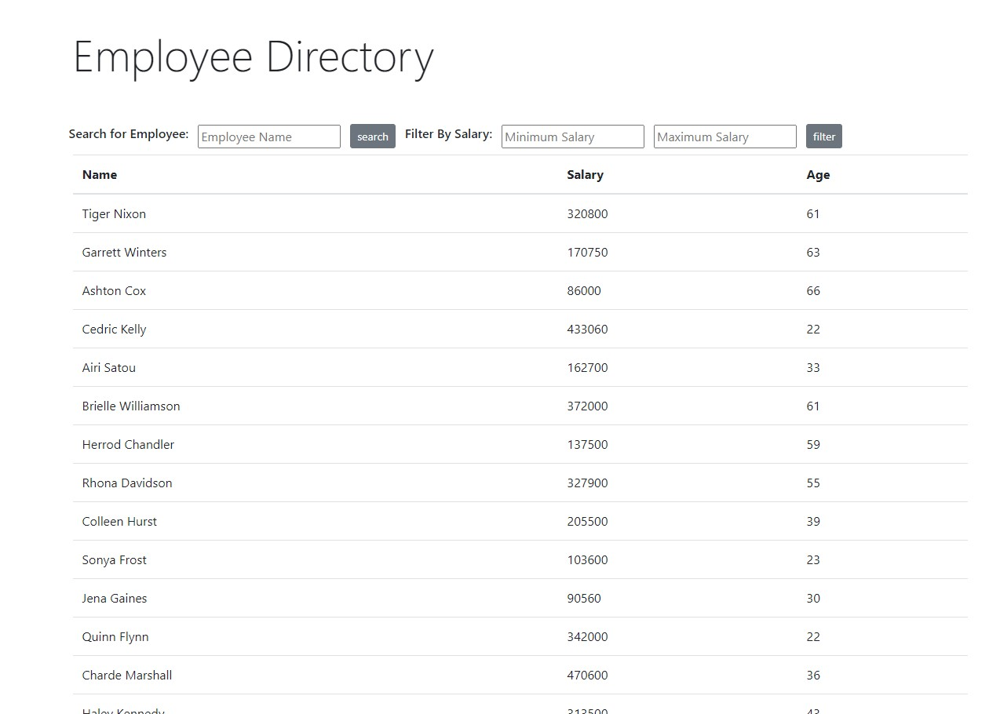

# Employee Directory

React app that allows users to view a list of employees, and sort, filter and seach within it.



## Installation

clone repo and then 

```bash
npm install
```
to install dependencies

## Usage

```node.js
npm start
```

navigate to localhost

-or-

go to http://employee.directory.demo.s3-website.us-east-2.amazonaws.com/

directory is randomly generated

you can search for employees by name and filter employees by minimum and maximum salaries.


## Contributing

Pull requests are welcome. For major changes, please open an issue first to discuss what you would like to change.

## License

[MIT](https://choosealicense.com/licenses/mit/)
